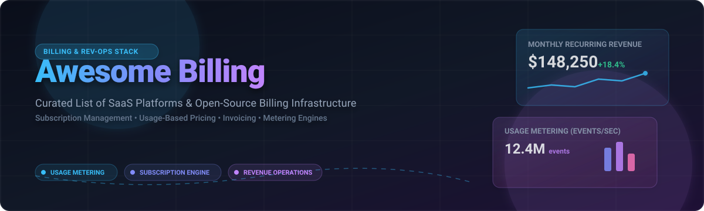

# 💳⚡ Awesome Billing Infrastructure & Ecosystem 🚀

**A curated list of top SaaS platforms and open-source software for subscription management, usage-based billing, metering engines, payment orchestration, and revenue operations.** 🎯💰

---

## 📌 Overview & Key Architectural Patterns 🏗️

Modern financial technology relies on robust **billing infrastructure** to manage recurring subscriptions, track consumption-based metrics, automate invoicing, recover failed payments (dunning), and maintain accounting compliance (ASC 606 / IFRS 15). 📈

This repository categorizes the top commercial SaaS solutions and production-grade open-source billing engines to help SaaS founders, software architects, finance teams, and developers choose the best stack. 🌐💡

---

## 📑 Table of Contents 🧭

- [📊 Market Size & Sector Insights](#-market-size--sector-insights-)
- [🏢 SaaS & Commercial Platforms](#-saas--commercial-platforms-)
- [💻 Open-Source GitHub Projects](#-open-source-github-projects-)
- [🧩 Framework Comparison Matrix](#-framework-comparison-matrix-)
- [🛠️ How to Contribute](#️-how-to-contribute)
- [💖 Support & Community](#-support--community)
- [📈 Star History](#-star-history)
- [⚖️ Disclaimer](#-disclaimer)

---

## 📊 Market Size & Sector Insights 🔍

> 💼 **Market Size & Structure:** The global subscription management and billing software market is estimated at **~$6.8 Billion in 2024** and is projected to expand to **~$16.5 Billion by 2032** at a CAGR of ~14.5%. 📈
> 
> The sector is **moderately fragmented**, divided across three primary paradigms:
> 1. ⚡ **Developer-Led Usage Metering:** High-throughput event ingestion engines (Orb, Lago, OpenMeter) built for AI token consumption and API pricing.
> 2. 🔄 **Subscription & Growth Engines:** All-in-one payment and billing suites (Stripe Billing, Chargebee, Recurly) designed for SaaS monetization and revenue recovery.
> 3. 🏢 **Enterprise Quote-to-Cash (Q2C):** Complex multi-entity financial platforms (Zuora, BillingPlatform) handling contract billing and ledger compliance.

---

## 🏢 SaaS & Commercial Platforms 💼

*Commercial platforms managing recurring subscriptions, payment gateway integrations, automated dunning, and enterprise monetization.* 💸

| 🚀 Platform | 📝 Primary Focus & Description | 💵 Pricing (Starting Tier) | 🎁 Free Tier / Trial Limits | 📊 Company Size / Valuation |
| :--- | :--- | :--- | :--- | :--- |
| **[Stripe Billing](https://stripe.com/billing)** 💳 | Comprehensive recurring billing, metered usage infrastructure, and global payment processing. | 0.5% of recurring volume (Starter) / 0.8% for usage-based | **First $100k billing volume free** (0.5% thereafter); unlimited test sandbox mode 🧪 | **$159 Billion Valuation** 🦄 (~$6.8B Revenue) |
| **[Chargebee](https://www.chargebee.com/)** 🐝 | All-in-one subscription management, revenue recovery, dunning, and tax compliance platform. | $599/mo (Performance plan includes $100k/mo billings + 0.75% overage) | **Starter Plan Free up to $250,000 cumulative billing** 🎉 (0.75% overage after); 14-day trial | **$3.5 Billion Valuation** 🦄 (~$100M+ ARR) |
| **[Zuora](https://www.zuora.com/)** 🏛️ | Enterprise-grade quote-to-cash platform for subscription economics and revenue recognition. | Custom enterprise contract (starts at ~$1,000/mo or $25k+/yr base fee) | **30-day interactive sandbox access** 🔑 upon sales demo request | **$1.7 Billion Valuation** 🦄 (~$430M ARR) |
| **[Recurly](https://recurly.com/)** 🔄 | Subscription billing, smart payment routing, and churn recovery for B2B and direct-to-consumer SaaS. | $249/mo + 0.9% of total billing volume (Core plan) | **90-day free trial on Starter plan** ⏳; full test gateway sandbox access | **~$300 Million Valuation** (~$80M ARR) |
| **[Maxio](https://www.maxio.com/)** 📊 | Billing and financial operations engine combining subscription billing with B2B SaaS metrics (Chargify + SaaSOptics). | $599/mo (Grow plan up to $100k/mo billing) + volume fees | **"Build" plan is Free forever sandbox** 🛠️ (no live invoicing); 14-day trial | **~$250 Million Valuation** (~$50M ARR) |
| **[BillingPlatform](https://billingplatform.com/)** ⚙️ | Enterprise revenue management for complex hybrid pricing models and quote-to-cash workflows. | Custom enterprise quote (starts at ~$25,000/yr base contract) | **30-day guided interactive sandbox** 🧪 upon sales request | **~$250 Million Valuation** (~$40M ARR) |
| **[Orb](https://www.withorb.com/)** 🔮 | Usage-based billing platform designed for AI, API, and infrastructure consumption pricing models. | $500/mo base plan + volume-based event ingestion fees | **Unlimited developer sandbox access** 💻 with simulated event stream testing | **~$250 Million Valuation** ($191M Raised, ~$15M ARR) |
| **[m3ter](https://www.m3ter.com/)** ⏱️ | High-throughput data metering engine and complex pricing logic calculator. | $500/mo base fee + consumption fee per 10,000 data events | **30-day developer sandbox trial** ⚡ with up to 1,000,000 test events | **~$100 Million Valuation** ($31M Raised, ~$10M ARR) |
| **[Lago Cloud](https://www.getlago.com/)** 🦩 | Managed cloud usage-based metering and subscription engine based on open-source Lago core. | Self-hosted core is $0; Managed Cloud starting at scale rates | **Open-source self-hosted version is 100% Free forever** 🔓; 14-day Cloud trial | **~$100 Million Valuation** ($22M Raised, ~$5M ARR) |
| **[Ordway](https://ordwaylabs.com/)** 📈 | Billing and revenue automation software for scaling subscription and consumption businesses. | $750/mo base plan + tier scale volume fees | **14-day developer sandbox environment** ⚙️ | **~$50 Million Valuation** ($20M Raised, ~$8M ARR) |

---

## 💻 Open-Source GitHub Projects 🛠️

*Open-source engines and self-hosted tools for full data sovereignty, customizable pricing rules, and transparent billing pipelines. Ordered descending by GitHub star count.* ⭐

1. **[Hyperswitch](https://github.com/juspay/hyperswitch)**  — **45,177 stars** ⭐  
   *Language: Rust 🦀 | License: Apache-2.0*  
   Open-source, composable payment orchestration platform. Connects 120+ payment processors via a unified API with smart routing, card vaulting, auto-retry revenue recovery, and payment reconciliation. 💳⚡

2. **[Lago](https://github.com/getlago/lago)**  — **10,632 stars** ⭐  
   *Language: Go 🐹 | License: AGPL-3.0*  
   Open-source metering and usage-based billing API designed for AI, cloud, and API products. Handles consumption tracking, tiered pricing models, prepaid credits, and subscription orchestration. 🦩🚀

3. **[Invoice Ninja](https://github.com/invoiceninja/invoiceninja)**  — **10,126 stars** ⭐  
   *Language: PHP (Laravel) 🐘 | License: Source-Available*  
   Comprehensive self-hosted invoicing, client management, quote generation, and project time-tracking suite built for agencies, freelancers, and small businesses. 🥷🧾

4. **[FlexPrice](https://github.com/flexprice/flexprice)**  — **6,927 stars** ⭐  
   *Language: Go 🐹 | License: AGPL-3.0*  
   Flexible usage-based pricing and billing infrastructure for developers. Features real-time usage metering, credits and top-ups, no-code UI, and feature entitlement control. 🏷️✨

5. **[Kill Bill](https://github.com/killbill/killbill)**  — **5,766 stars** ⭐  
   *Language: Java ☕ | License: Apache-2.0*  
   The battle-tested open-source subscription billing and payments platform. Features versioned catalog management, multi-phase subscription engine, plugin system, and the Kaui admin portal. 🗡️💥

6. **[InvoicePlane](https://github.com/InvoicePlane/InvoicePlane)**  — **3,145 stars** ⭐  
   *Language: PHP 🐘 | License: MIT*  
   Clean, self-hosted open-source application for managing invoices, client records, payments, and quotes without third-party recurring SaaS fees. ✈️📄

7. **[Autumn](https://github.com/useautumn/autumn)**  — **2,692 stars** ⭐  
   *Language: TypeScript 🔷 | License: Apache-2.0*  
   Developer-centric billing layer for AI startups that wraps around Stripe. Enables rapid plan setup, credit tracking, and entitlement enforcement in 30 minutes with zero webhooks. 🍂🤖

8. **[Laravel Cashier](https://github.com/laravel/cashier-stripe)**  — **2,548 stars** ⭐  
   *Language: PHP 🐘 | License: MIT*  
   Official Laravel integration package providing an expressive, fluent interface to Stripe subscription billing services, coupons, plan swaps, and PDF invoice downloads. 🏪💳

9. **[OpenMeter](https://github.com/openmeterio/openmeter)**  — **2,350 stars** ⭐  
   *Language: Go 🐹 | License: Apache-2.0*  
   Real-time event metering engine built on ClickHouse and Kafka for AI models, DevTools, and APIs. Aggregates millions of usage events per second for consumption-based billing. ⚡⏱️

10. **[Paymenter](https://github.com/Paymenter/Paymenter)**  — **2,321 stars** ⭐  
    *Language: PHP 🐘 | License: MIT*  
    Free open-source webshop and client management portal tailored for hosting providers, integrating with Pterodactyl, cPanel, DirectAdmin, and cPanel. 🖥️🛒

11. **[Lotus](https://github.com/uselotus/lotus)**  — **1,838 stars** ⭐  
    *Language: Python 🐍 | License: MIT*  
    Open-source pricing and packaging infrastructure to design, deploy, and experiment with custom billing models, subscription add-ons, and real-time metering. 🪷🧪

12. **[Meteroid](https://github.com/meteroid-oss/meteroid)**  — **1,239 stars** ⭐  
    *Language: Rust 🦀 | License: AGPL-3.0*  
    Modern Rust-based billing software designed for PLG companies. Features subscription management, usage metering, cost limiting, and actionable revenue analytics. 🚀📊

13. **[SolidInvoice](https://github.com/SolidInvoice/SolidInvoice)**  — **973 stars** ⭐  
    *Language: PHP (Symfony) 🐘 | License: MIT*  
    Elegant invoicing tool for small businesses featuring recurring billing, quotes, multi-currency support, REST API, and built-in AI agent MCP server automation. 💎🤖

14. **[Tier](https://github.com/tierrun/tier)**  — **969 stars** ⭐  
    *Language: Go 🐹 | License: BSD-3-Clause*  
    Tool for managing SaaS pricing models directly from code/JSON configs. Enforces plan limits and metered features backed by Stripe Billing. 🎚️⚙️

15. **[UniBee](https://github.com/UniBee-Billing/unibee)**  — **231 stars** ⭐  
    *Language: Docker / Java 🐳 | License: AGPL-3.0*  
    Universal standalone billing platform for SaaS products providing subscription engines, invoice automation, billable metrics, and webhooks. 🐝📦

16. **[Recurso](https://github.com/recurso-dev/recurso)**  — **5 stars** ⭐  
    *Language: Go 🐹 | License: MIT*  
    Open-source billing engine with a built-in double-entry financial ledger, ASC 606 revenue recognition, smart dunning, and multi-country tax compliance (GST/VAT). 📘⚖️

---

## 🧩 Framework Comparison Matrix 🧭

| 🎯 Use Case / Scenario | 💼 Recommended Commercial SaaS | 💻 Recommended Open-Source Stack |
| :--- | :--- | :--- |
| ⚡ **AI Token & API Metering** | Orb, m3ter | OpenMeter, Lago |
| 🔄 **B2B SaaS Subscriptions** | Stripe Billing, Chargebee, Recurly | Kill Bill, FlexPrice |
| 🏛️ **Enterprise Quote-to-Cash** | Zuora, BillingPlatform | Kill Bill + Kaui |
| 🖥️ **Hosting & Service Provisioning** | Maxio | Paymenter, Invoice Ninja |
| 📄 **Freelancer & Agency Invoicing** | Stripe Invoicing | SolidInvoice, InvoicePlane |

---

## 🛠️ How to Contribute 🤝

Contributions are welcome! To add or update an entry:

1. Fork this repository. 🔀
2. Update `README.md` following the existing tabular and list formats. 📝
3. Ensure open-source entries include valid GitHub star badges and links. ⭐
4. Submit a Pull Request with a short description of the tool. 🚀

---

## 💖 Support & Community 🌟

If you find this repository helpful for your billing infrastructure research or SaaS stack evaluation, please consider supporting the project:

- 🌟 **Star this repository** to help others discover it on GitHub!
- 🔀 **Fork the repo** to customize and submit your contributions via PR.
- 📢 **Share with colleagues**, software engineers, SaaS founders, and finance teams.
- ☕ **Buy a Coffee / Sponsor**: Support ongoing maintenance via the [GitHub Sponsor Dashboard](https://github.com/sponsors/ishandutta2007).

---

## 📈 Star History 📊

---

## ⚖️ Disclaimer ⚠️

*This list is community-curated for informational purposes. Billing infrastructure handles sensitive payment card data (PCI DSS) and financial revenue reporting (ASC 606 / IFRS 15 / VAT / GST). Always perform independent technical, accounting, and compliance evaluations when integrating billing platforms.*
